# StoryWeaver AI - System Architecture Diagram

## Technology Stack Architecture (High-Level)

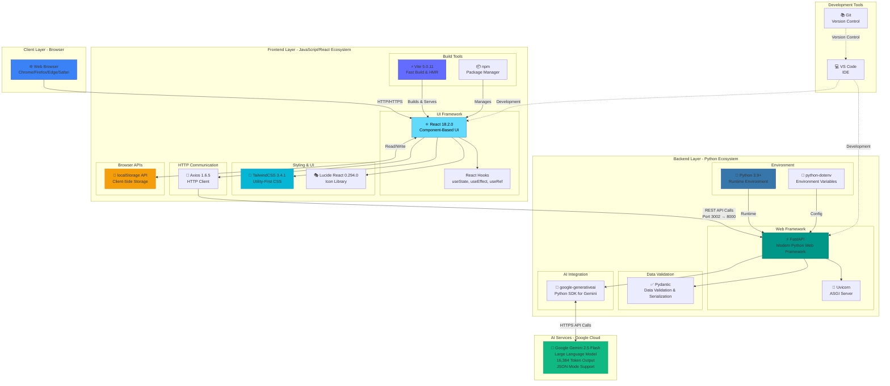

## Simplified 3-Tier Architecture

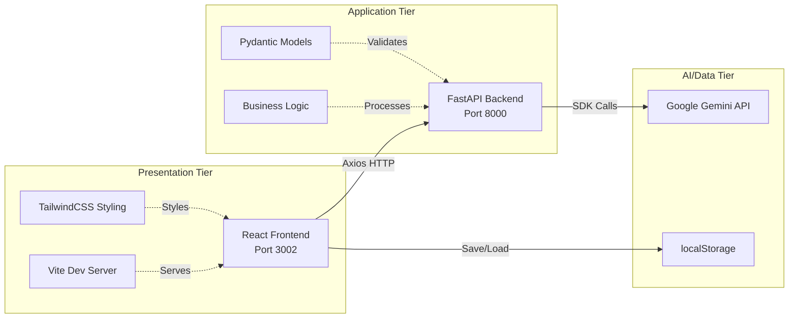

## Complete Technology Stack Overview

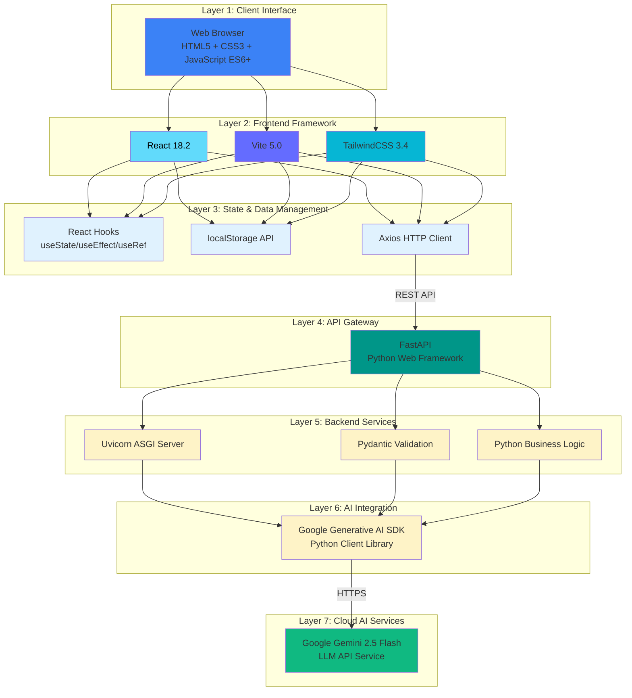

## Technology Dependencies Map

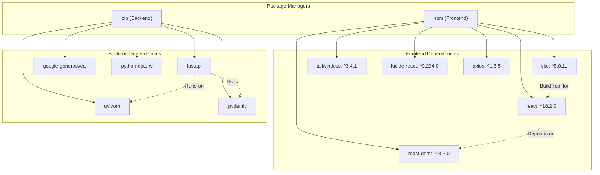

## Network Communication & Ports

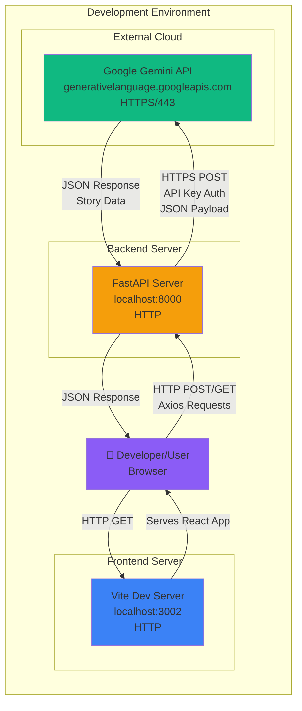

## Technology Feature Matrix

| Technology | Purpose | Version | Key Features Used |
|------------|---------|---------|-------------------|
| **React** | UI Framework | 18.2.0 | Hooks, Virtual DOM, Component Lifecycle |
| **Vite** | Build Tool | 5.0.11 | HMR, Fast Builds, ES Modules |
| **TailwindCSS** | Styling | 3.4.1 | Utility Classes, Custom Animations |
| **Lucide React** | Icons | 0.294.0 | Tree-shakable Icons, Customizable |
| **Axios** | HTTP Client | 1.6.5 | Promise-based, Interceptors, Error Handling |
| **FastAPI** | Web Framework | Latest | Auto Docs, Async, Type Hints |
| **Uvicorn** | ASGI Server | Latest | Fast, ASGI3 Compatible |
| **Pydantic** | Validation | Latest | Type Validation, JSON Schema |
| **google-generativeai** | AI SDK | Latest | Gemini Integration, Streaming |
| **Gemini 2.5 Flash** | LLM | Latest | 16K Tokens, JSON Mode, Fast |

## High-Level Architecture

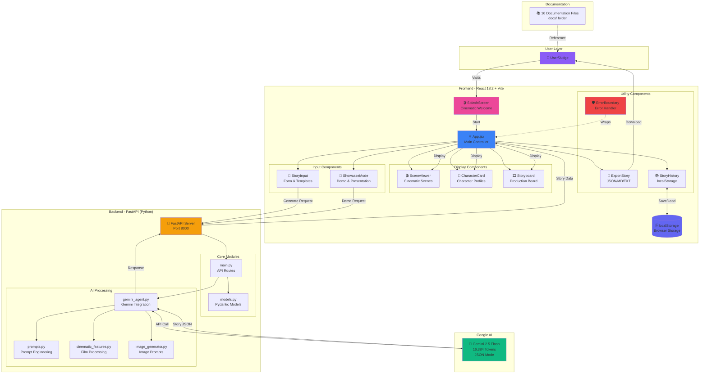

## Detailed Data Flow

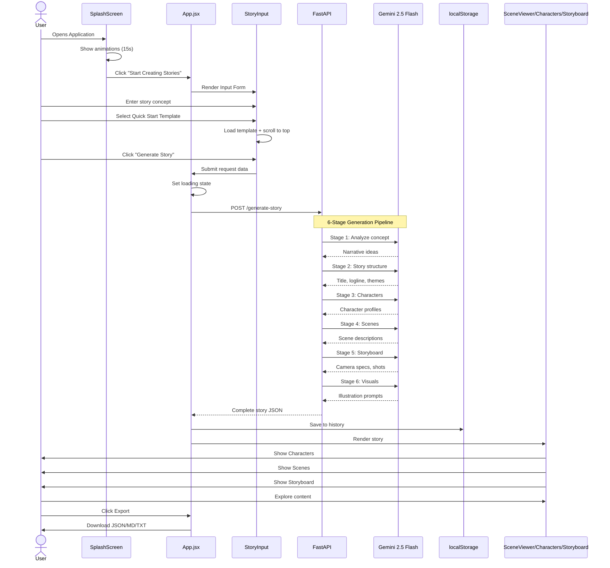

## Component Architecture

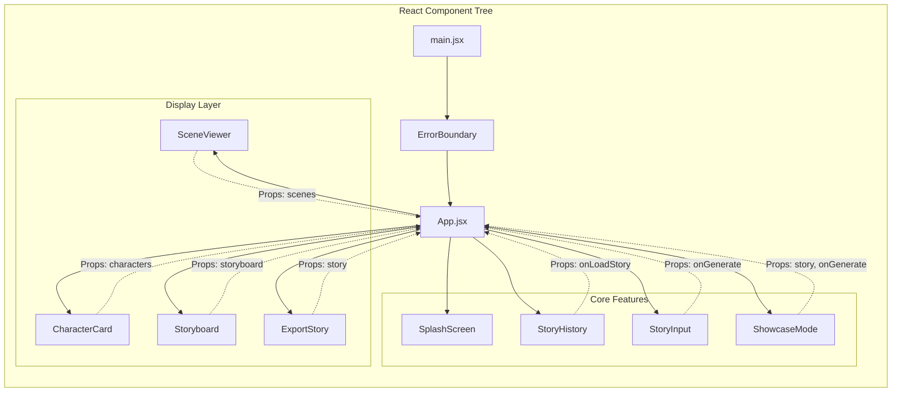

## Backend API Architecture

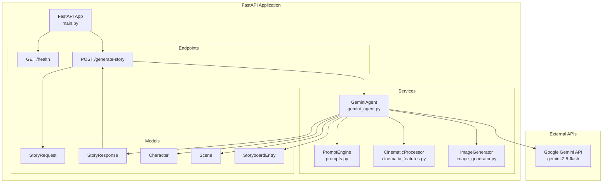

## State Management Flow

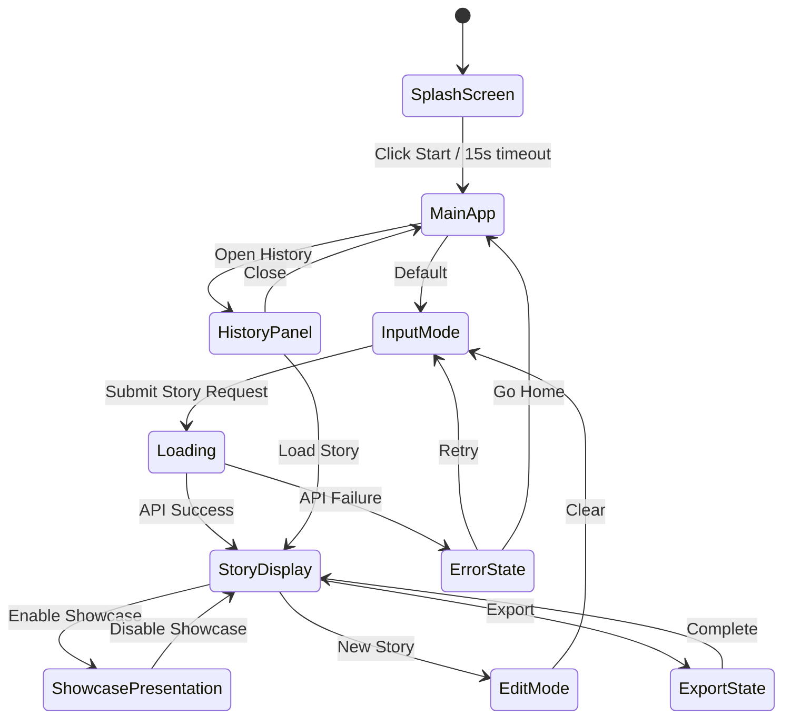

## Technology Stack

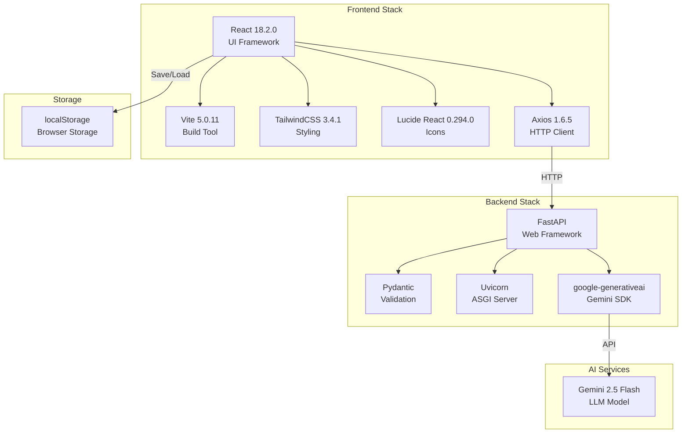

## Deployment Architecture

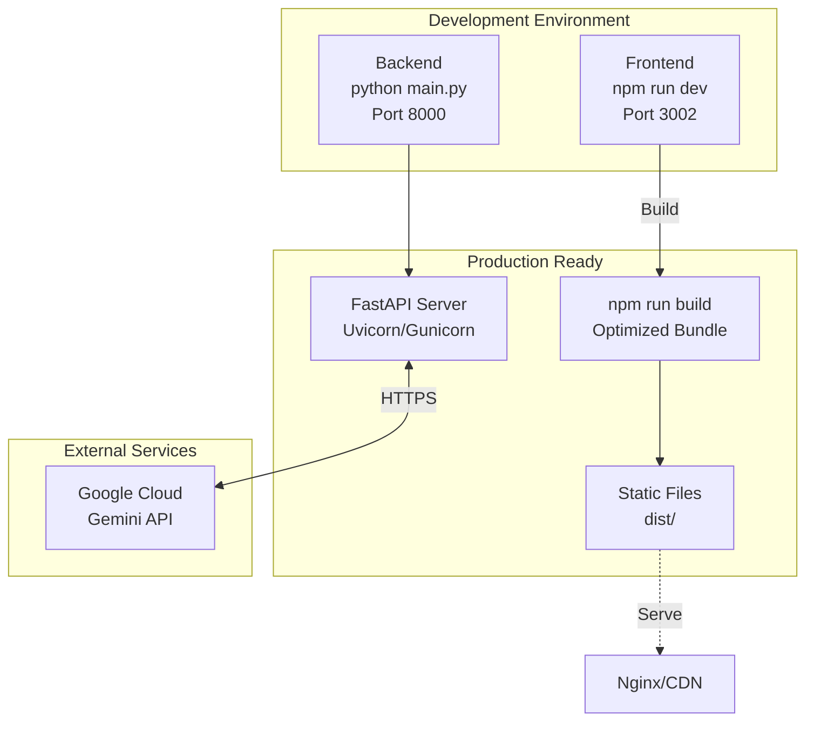

## Security & Error Handling

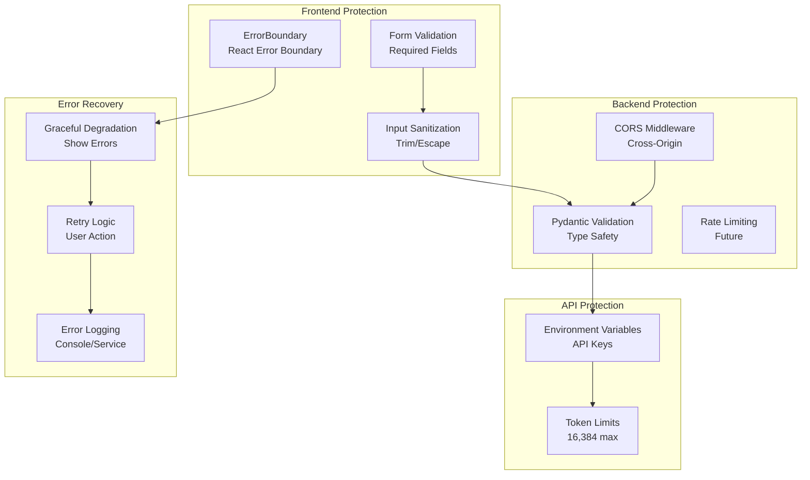

## Feature Flow Map

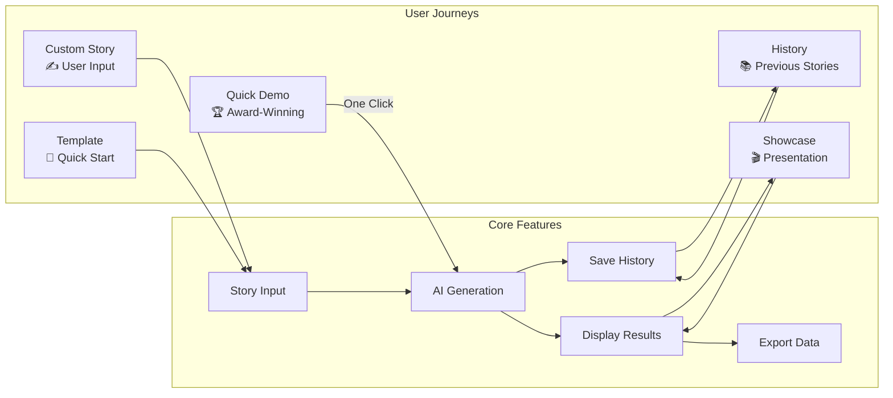

---

## Key Architecture Highlights

### ✅ Strengths

1. **Separation of Concerns**
   - Frontend: React components isolated
   - Backend: API, services, models separated
   - Clear data flow through props/state

2. **Error Resilience**
   - ErrorBoundary wraps entire app
   - API error handling with user feedback
   - Graceful degradation

3. **Performance**
   - Vite for fast HMR
   - React 18 concurrent features
   - Optimized bundle size

4. **Scalability**
   - Modular component design
   - RESTful API architecture
   - Environment-based configuration

5. **User Experience**
   - 6-stage loading feedback
   - localStorage persistence
   - Smooth animations
   - Responsive design

### 🎯 Data Flow Summary

```
User Input → StoryInput → App.jsx → FastAPI → Gemini 2.5 Flash
                                                    ↓
User Display ← SceneViewer ← App.jsx ← FastAPI ← JSON Response
         ↓
   localStorage (History)
```

---

**Ready for Google Gemini Live Agent Challenge 2026** 🚀
